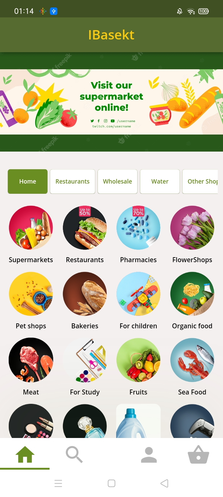
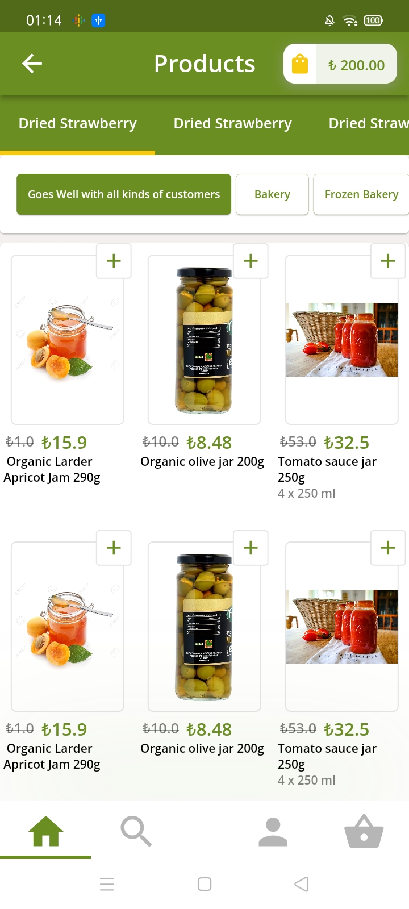
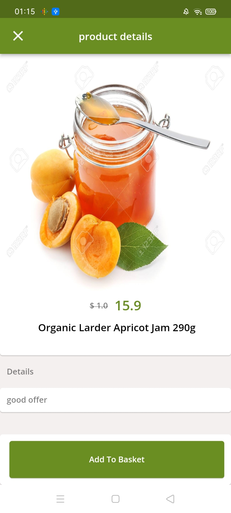
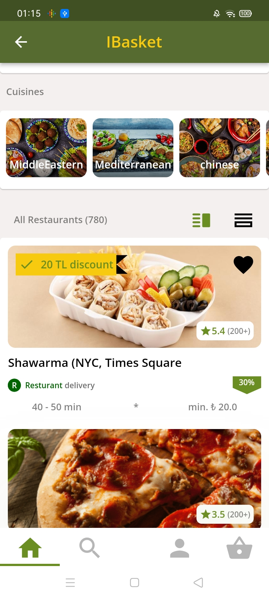

# IMarket App
## Grocery delivery app, using Flutter Framework 

# This app was developed for Educational purposes only, it's not for any business purpose over, if there any similarities with features or design with other apps, this was not intend and done just for the learning purposes

<table>

   <tr>
    <td> </td>
   <td> </td>
      

 </tr>
   
  <tr>
    <td> </td>
   <td> </td>
      

 </tr>
</table>
