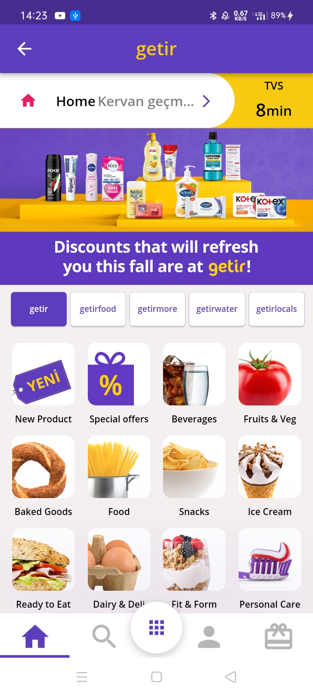
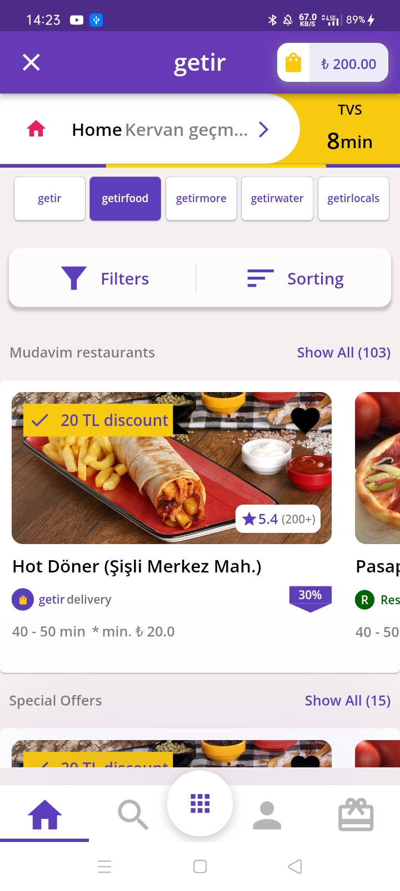
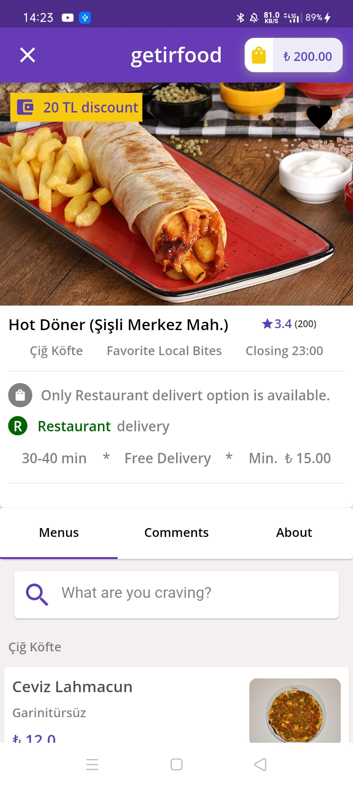
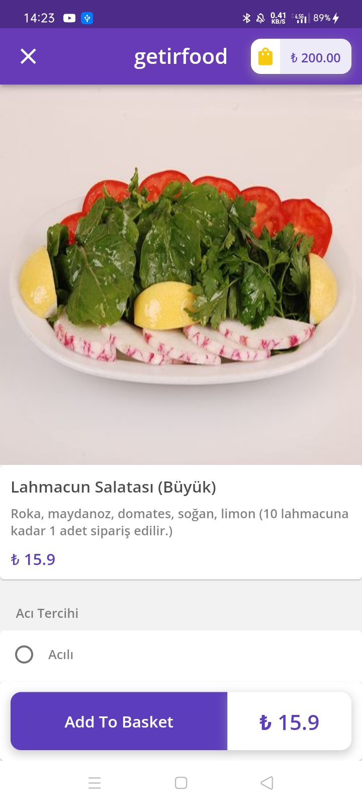
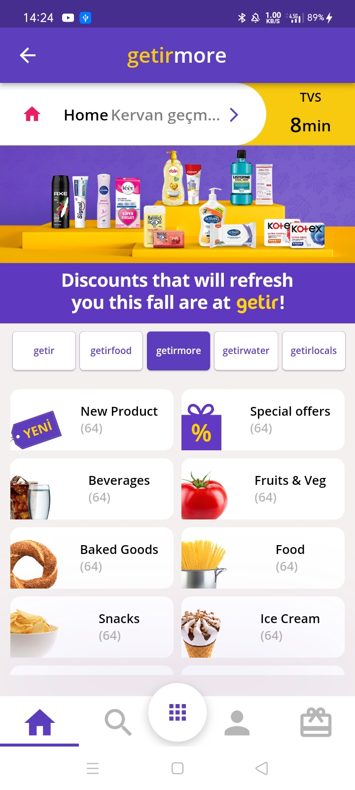
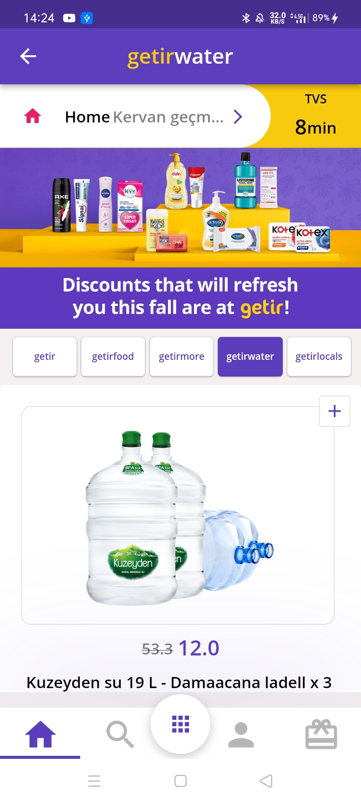
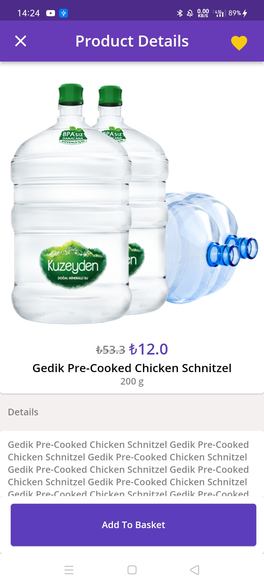
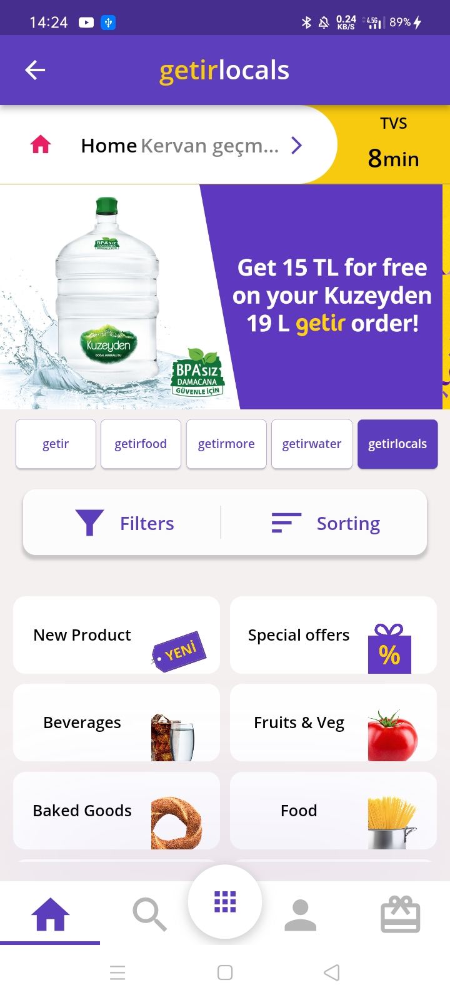

# Github Clone.
## a clone for famous grocery and food delivery app Getir (only design) using Flutter
<table>

   <tr>
    <td> </td>
    <td> </td>
    <td> </td>
 </tr>
  
  <tr>
    <td> </td>
    <td> </td>
    <td> </td>

  </tr>
   <tr>
    <td> </td>
    <td> </td>
    <td> </td>

  </tr>
</table>
